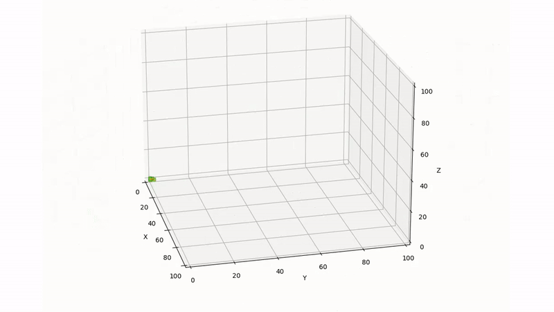

# PCS
Project Computational Science Group 7 \
Ishana Bohorey \
Sara Stoof \
Oskar Linke \
Windar Mazzori

# 3D Mold modelling
The aim of this project is to simulate mold growth in 3D using DLA (diffusion-limited aggregation). The main file ``dla_3d.py`` runs a set number of simulations based on the given runtime arguments.

# Dependencies
* Numpy, this is used to calculate things you couldn't do with base Python, mostly with regards to points in a circle. \
Install using ``pip install numpy``
* Numba, this is used to speed up most of the program. \
Install using ``pip install numba``
* Matplotlib, this is used to visualize the final grid. \
Install using ``pip install matplotlib``
* Scipy, this is used to calculate the calculate the standare errror mean for plotting. \
Install using ``pip install scipy``
* Dash, this is used as the framework for the GUI. \
Install using ``pip install dash``
* Plotly, this is used to plot the graphs in the GUI. \
Install using ``pip install plotly``

# Runtime instructions
To start the program, run ``python3 dla_3d.py <NUM_SIMS> <BATCH_SIZE> <TEMP> <RH>`` where every value between brackets is a variable. If you simply run ``python3 dla_3d.py`` (or if you don't run it with the correct amount of arguments) the default values will be used instead.
* ``NUM_SIMS`` is the amount of simulations that will be run. Since there is a stochastic element in the program, taking the average over a few runs is necessary to obtain a reasonably recreatable result. \
 The default for this is 5.
* ``BATCH_SIZE`` is the amount of particles that is spawned in with each step. \
The default for this is 1000.
* ``TEMP`` is the temperature in celsius, which could influence the growth and decay of particles. \
The default for this is 30.
* ``RH`` is the relative humidity, which also influences the growth and decay of particles. \
The default for this is 97.
Then follow the terminal instructions by choosing the grid dimensions and spawn point coordinates. The default is respectively 100x100x100 and (50, 50, 100).

# Output
Running ``dla_3d.py`` gives some data and a few plots as output.
## Output format
All data is outputted to ``stdin``. The first line prints the time taken to run the simulations. The second and third line print the attachment probability and decay probability, which are calculated using the user inputted ``TEMP`` and ``RH``. The fourth, fifth and sixth line show the mold coverage, where the sixth line shows the mold coverage only on the surface. The seventh and eighth line show the M-value, which is the mold index, a way of showing how much mold has grown.

## Plots
The first plot is the number of particles per layer. The second plot show different slices among the axes. The last plot is a 3D plot of the average grid of every simulation run.

# Instructions to Run the Tests
## Test 2D: ``2d_test/2d_test.py``
This will result in 2 plots of the average mold coverage with varying temperature and relative humidity values. Which can be seen in the '2d_test/plots' directory.

## Test 3D: ``3d_test/3d_test.py``
This test was performed on different spawning points (surface, edge, corner). It results in 4 plots of the average volumetric and surface mold coverage with varying temperature and relative humidity values. Testing these spawning points can be done by uncommenting and commenting some globals in the script itself. Which can be seen in the '3d_test/plots' directory. Make sure to run this while in the `3d_test` directory.

## Test Speedup: ``test_speedup/test_speedup.py``
This test is a script that executes our DLA implementation with varying parameters such as num_sims, batch_size and no_hits_max to identify the speedup Numba gives. The no_hits_max parameter determines how long the particles loop without touching the cluster before breaking the loop. We used the results from these tests to determine the optimal no_hits_max. We visualized our results by running our script ``test_speedup/visualize_speedup.py``. The resulting plots can be found in the 'test_speedup/plots' directory. Make sure to run this while in the speedup directory.

## Test Multiple Spawning Points: ``test_multiple_spawning_points/test_multiple_spawning_points.py``
This file measures the average mold coverage when adding multiple random spawning points to the grid and visualizes the result. The resulting figures and plots can be found in the 'test_multiple_spawning_points/plots'.

# Intructions for Bonus Versions
Apart from the main file `dla_3.py`we have bonus versions of our DLA model. These versions include cool features we wanted to include. Make sure to run this while in the `bonus_versions` directory.

## Simulation: ``bonus_versions/dla_3dsim.py``
This version of the program visualizes the simulation of 'dla_3d.py' for each timestep.

## Multiple Spawning points: ``bonus_version/dla_3d_spawning_points``
This version of the program spawns a given amount of random seeds in the grid (multiple random spawning points).

## 2D: ``bonus_version/dla_2d.py``
This file is the 2D implementation of our DLA model.

## GUI Demo:
This is a demo version of a graphical user interface. It provides basic functionality, allowing users to set parameters more intuitively than using the terminal.

It uses a stand-alone `dla_3d_for_gui.py`, which uses a slightly modified version of our functions to integrate with the Dash framework. It still depends on the functions in the `helpers` directory.

To try the GUI demo, navigate to the main directory of this repository and run:

``python3 -m gui.web_gui``

Then, open the provided localhost link (e.g., http://127.0.0.1:8050/).

Tip: If port 8050 is in use by another program, use `lsof -i :8050` to identify the corresponding PID and kill that program with `kill -9 <PID>`.